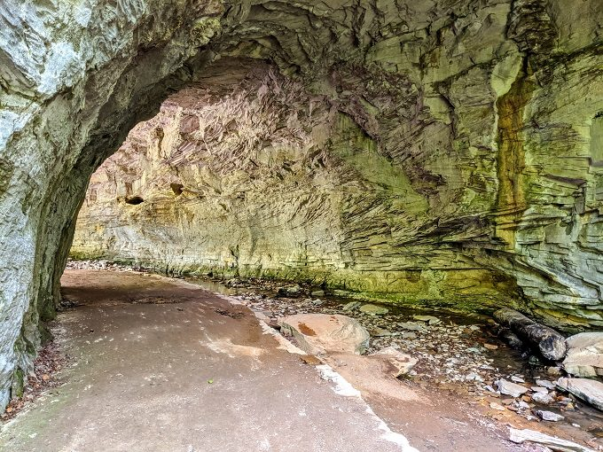
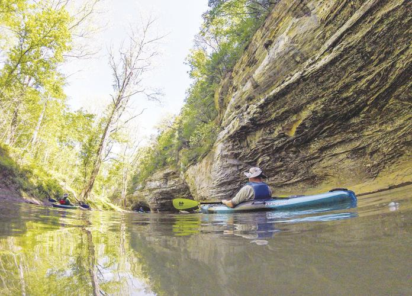
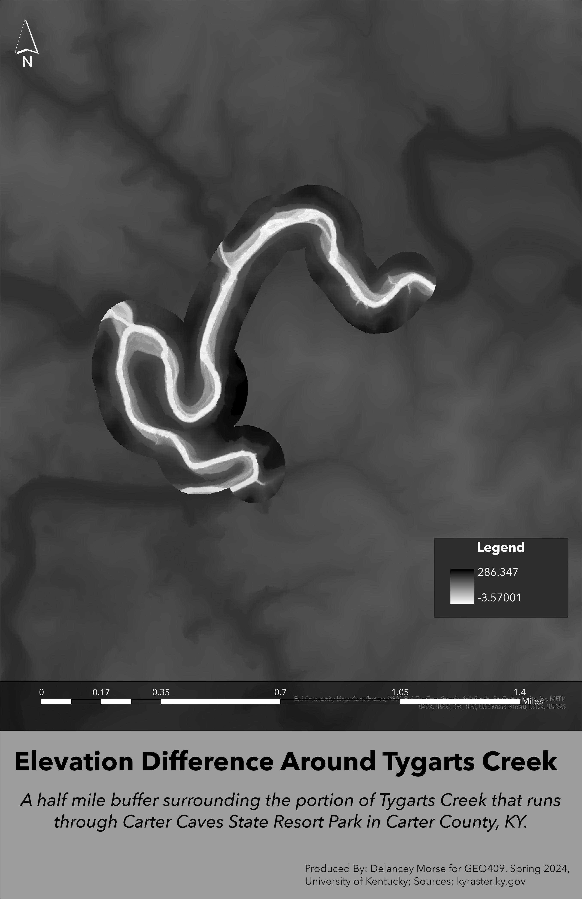

# Buried in White Trash
## A hidden gem within rural Eastern Kentucky

Carter Caves State Resort Park is located within Carter County, Kentucky. It has an expanse of walking trails as well as campground and primitive camping. It is home to three different endangered species, including the Indiana bat, mountain maple, and Canada yew. It also has the most caves of any area in Kentucky! 

     
*Location of Carter Caves State Resort Park*

[*Natural Bridge at Carter Caves*](https://nohomejustroam.com/4-natural-bridges-in-1-day-at-carter-caves-state-resort-park-in-kentucky/)

Carter Caves is often overlooked because of its location. Even people living in the area do not frequently visit the Park. It has many different things to offer. In hopes of shedding light to an area that is often underserved, this webage was created. 

     
*Shaded relief map for Carter Caves*

[Link to high-resolution version](Shaded.pdf)

[*Kayaking on Tygarts Creek*](https://www.herald-dispatch.com/features_entertainment/carter-caves-tygarts-creek-trips-among-parks-growing-adventure-offerings/article_8ae81033-3b3c-5a9e-a7d8-4d0a1de4db96.html)

Within the boundary of Carter Caves, there is a locally popluar creek that runs through it. If you live in Carter County, you or someone you know has been swimming in Tygarts Creek. Here is a map showing the elevation surrounding the portion of Tygarts Creek that runs through Carter Caves. 

     
*Elevation gradient for Tygarts Creek*

[Link to high-resolution version](TCelev.pdf)  

I created a webpage further detailing the wonders of Carter Caves State Resort Park! Hopefully this project and webapge, and their geographical visualizations, will bring interest to the area!

     
*Webpage screenshot*

[*Link to video*](https://www.youtube.com/watch?v=sCwGhlEWhLQ)

Produced By: Delancey Morse for the GEO409 at the University of Kentucky. Made using ArcGIS Pro, ArcPy, Cesium, Blender, and information from [Wikipedia.com](https://en.wikipedia.org/wiki/Carter_Caves_State_Resort_Park) , kyraster.ky.gov raster information, [National Hydrology Dataset](https://apps.nationalmap.gov/downloader/#/)and KyFromAbove. [Picture 1](https://nohomejustroam.com/4-natural-bridges-in-1-day-at-carter-caves-state-resort-park-in-kentucky/) [Picture 2](https://nohomejustroam.com/4-natural-bridges-in-1-day-at-carter-caves-state-resort-park-in-kentucky/)